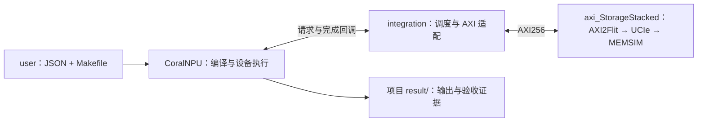

# CoralNPU StorageStacked

阅读入口：[文档目录](docs/README.md) · [逐文件中文讲解](https://github.com/hy2581/StorageStacked-docs)。

在 CoralNPU RTL 中执行用户程序，通过 AXI256、UCIe 访问在线 MEMSIM。
用户只需操作根目录 `build.sh` 和 `user/`；`coralnpu/` 提供设备、工具及运行支持。

```text
./
├── README.md
├── build.sh                  路径配置与整体编译
├── user/
│   ├── run.sh                通用项目入口
│   ├── smoke/                config.json、src/、result/
│   └── llm/                  config.json、src/、result/
├── docs/                     环境、SMOKE、LLM 和 integration 说明
├── coralnpu/                 CoralNPU 源码、SDK、工具、运行与校验
└── integration/              仿真入口、设备参数和 AXI 存储接入
```

`integration/main.cc` 启动仿真，`config.hh` 定义接入参数，
`axi_master.*` 将设备请求转换为 AXI 信号，`storage.*` 连接公共存储；
`CMakeLists.txt` 将这些文件编译为运行器。

## 阅读指南

| 文档 | 适用场景 |
|---|---|
| [用户环境配置说明](docs/01-用户环境配置说明.md) | 首次构建、路径配置、修改 NPU／AXI／UCIe／MEMSIM 参数 |
| [从 0 添加 SMOKE 简要指南](docs/02-用户从0开始添加SMOKE简要指南.md) | 新建项目，编写 JSON、C++、Makefile，运行并查看结果 |
| [LLM 简要说明](docs/03-LLM简要说明.md) | 了解 TinyLLM 文件、输入、计算流程和输出 |
| [integration 介绍](docs/04-integration介绍.md) | 按文件了解构建、仿真入口、AXI 转换和存储连接 |

## 构建与运行

在 Linux x86_64 环境中构建，初次启动需系统已有 bash、python3、curl、tar、git 和 flock（util-linux）。
其余编译工具由脚本准备。将 `axi_StorageStacked` 与本仓库放在同一父目录，然后执行：

```bash
./build.sh --storage ../axi_StorageStacked --jobs 12
cd user
./run.sh smoke
./run.sh llm
```

依赖在其他位置时，`--storage` 仍使用相对于仓库根目录的路径。
路径选择由构建入口保存，后续可以直接执行 `./build.sh`。
整体构建的详细日志由黑盒保存在 `coralnpu/.cache/last-build.log`。
首次构建会准备锁定版本的工具；已有下载缓存可设置 `SS_OFFLINE=1`。

`build.sh` 构建设备与存储环境，并编译两个自带程序。
`user/run.sh` 直接编排三个步骤：调用项目 Makefile → 启动仿真运行 `program.elf` → 校验结果。
程序编译与整体编译的复杂度由 SDK 处理；用户无需手动运行 Bazel 或 CMake。

## 一个用户项目

```text
user/llm/
├── config.json
├── src/
│   ├── Makefile
│   ├── tinyllm.h              模型结构、词表与权重
│   └── tinyllm.cpp            初始化、注意力、FFN 和生成循环
└── result/
    └── <运行编号>/           build/program.elf、report.md、配置、日志和原始证据
```

每个项目只有一个手工维护的 JSON，参数都在这里修改：

| 配置组 | 参数 |
|---|---|
| `program` | SMOKE 的 input；LLM 的 prompt、generated_tokens、kv_cache |
| `npu` | clock_mhz |
| `axi` | period_ns、outstanding、planes、stalls、replay |
| `ucie` | lanes、rate_gtps、bits_per_symbol（1 或 2）、tat_ns |
| `memsim` | standard、channels、scale、queue、slots、response_hold |
| `simulation` | max_ticks，单位 fs |

编译期 UCIe 参数改变时自动构建对应运行器；其他运行参数直接传递。
不支持的字段或参数会被拒绝。更深层 DRAM 参数需要扩展公共存储接口后才能使用。
TinyLLM 固定为单层、8 维、2 个注意力头、16 维 FFN、16 字符上下文的 FP32 功能模型。
`tinyllm.h` 是模型数据来源；用于独立参考校验的模型快照随 ELF 保存。

## 结果与复验

运行结束会打印本次 `report.md` 的相对路径。报告集中展示输入输出、周期与检查结论。
`summary.json.passed=true` 才表示计算与链路全部通过；编译成功不表示运行通过。
实际生效参数在 `resolved.json`、`config.json`、`ucie_config.json`、`memsim_config.json`。
原始证据包括 AXI 五通道 VCD、NPU 请求、Flit、MEMSIM 与 DRAM/DFI 记录。
每次运行创建新目录，已有结果不会被覆盖。

```bash
# 在 user/ 中：
./run.sh smoke --test
./run.sh llm --test
# 在仓库根目录：
./build.sh --test
```

完整回归包含 2 个 SMOKE、6 个 LLM 场景、原生内存测试、在线 C ABI 和错误拒绝检查。
各场景结果留在所属项目的 result/，全套验收索引由内部测试工具保存。
历史运行结果见 [2026-09-25 验收记录](coralnpu/validation/2026-09-25-user-layout/README.md)；当前运行以新生成的 `summary.json` 为准。

## 添加自己的项目

复制 `user/smoke/` 的 config.json 与 src/ 到新的项目目录，修改源码和配置，然后执行
`./run.sh 新项目名`。入口按目录发现项目，无需注册名称或修改黑盒。
Makefile 使用 `coralnpu/sdk/app.mk`，声明 `SOURCES`；编译产物必须为 `$(OUT)/program.elf`。
设备程序使用 RV32 标量指令，成功写 mailbox `0xc0000000=0x600d0000`，然后执行 `wfi`。
外部存储地址窗口是 `0x90000000` 至 `0xbfffffff`。

自定义计算使用 `program.type="custom"`，`defines` 提供整数宏（源码中加 `APP_` 前缀），
`expect` 指定期望输出地址和值；程序必须将输出从外部内存读回，验证器核对真实返回字节。
SMOKE 和 TINYLLM 使用内置的专项独立校验。

## 连接与路径约定



配置中的依赖路径相对于仓库根目录；用户的 `--config`、`--output` 相对于所选项目目录，
其中输出必须位于 result/。运行快照中的 ELF 路径相对于当次结果目录。
脚本按自身位置定位项目，不要求从固定工作目录启动。
工具生成的绝对路径仅属于内部缓存；迁移整个仓库后先执行 `./build.sh`，它会重建失效环境与缓存。

相关仓库：[axi_StorageStacked](https://github.com/hy2581/axi_StorageStacked) 提供公共存储链路；
[vortex_StorageStacked](https://github.com/hy2581/vortex_StorageStacked) 是使用同一接口的另一个独立驱动。

许可证和上游版本保留在 `coralnpu/`；交付源码包含本平台的运行接口适配。
只使用公共存储源码，不加载其他处理器驱动；整个仿真进程使用一套 SystemC，时间分辨率 1 fs。
PHY/DFI 为行为模型；本项目的结果不代表物理芯片或通用大模型性能。
