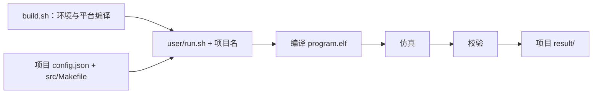

# 用户环境配置说明

[返回文档目录](README.md)。

以下命令从仓库根目录执行。日常使用只涉及 `build.sh` 和 `user/`。

## 1. 准备目录和工具

使用 Linux x86_64，将两个仓库放在同一父目录：

```text
工作目录/
├── axi_StorageStacked/
└── coralnpu_StorageStacked/
```

系统需要 Bash、Python 3、curl、tar、git 和 flock（util-linux）。首次构建需要网络，
脚本会准备固定版本的编译器、Bazel、Verilator、SystemC 等工具和依赖。

可以先检查基本命令是否可用：

```bash
command -v bash python3 curl tar git flock
```

## 2. 配置路径并整体编译

```bash
./build.sh --storage ../axi_StorageStacked --jobs 12
```

| 参数 | 用途 |
|---|---|
| `--storage` | 公共存储仓库的位置，相对于当前仓库根目录 |
| `--jobs` | 编译并行数，1～128；机器资源较少时可改为 4 |
| `--test` | 编译完成后执行完整回归 |

路径和并行数会保存，后续直接执行 `./build.sh` 即可。
完整构建日志在 `coralnpu/.cache/last-build.log`。
构建成功后，再运行用户项目检查计算和存储链路。

迁移仓库位置、修改设备或接入层源码、更新公共存储源码后，重新执行 `./build.sh`。
内部缓存由脚本维护，用户不需要手工配置库路径或工具目录。

## 3. 运行一个项目

```bash
cd user
./run.sh smoke
./run.sh llm
```

每次读取所选项目的 `config.json`，调用 `src/Makefile`，运行生成的 ELF，再校验结果。
结果写到该项目的 `result/<运行编号>/`，终端打印 `report.md` 的位置。



## 4. 修改项目配置

编辑 `user/smoke/config.json` 或 `user/llm/config.json`，然后重新运行该项目。
保留 JSON 中的全部字段；未知字段、缺失字段和非法值会被拒绝。

| 参数 | 默认值 | 含义／入口允许范围 |
|---|---|---|
| `program.type` | smoke / tiny_llm | 选择对应程序的配置与校验方式 |
| `program.input` | 41 | SMOKE 输入，0～4294967295 |
| `npu.clock_mhz` | 500 | 设备频率，1～10000；周期必须可表示为整数 fs |
| `axi.period_ns` | 2 | AXI 周期，整数 1～1000 ns |
| `axi.outstanding` | 16 | 适配层在途请求上限，1～128 |
| `axi.planes` | 2 | 存储资源平面数，1～4 |
| `axi.stalls` | true | 启用 AXI 握手停顿和响应反压测试 |
| `axi.replay` | false | 启用链路错误注入与重放检查 |
| `ucie.lanes` | 16 | lane 数，1～256 |
| `ucie.rate_gtps` | 24 | 每 lane 符号率，大于 0 且不超过 1000 GT/s |
| `ucie.bits_per_symbol` | 1 | 每符号位数，1 或 2 |
| `ucie.tat_ns` | 40 | 信用返回时间预算，0～1000000 ns |
| `memsim.standard` | hbm4 | hbm3、hbm4、lpddr5 或 lpddr6 |
| `memsim.channels` | 2 | 内存通道数，1～1024 |
| `memsim.scale` | 1 | 内存周期倍率，1～1024；越大越慢 |
| `memsim.queue` | 4 | 原生内存队列深度，1～1024 |
| `memsim.slots` | 8 | 内存桥同时持有的 burst 数，1～1023 |
| `memsim.response_hold` | 0 | 内存完成后额外等待的内存周期数，0～1000000 |
| `simulation.max_ticks` | 20000000000000 | 仿真上限，单位 fs；1～10^17，超时判失败 |

LLM 的 prompt、生成长度和 KV cache 配置见 [LLM 简要说明](03-LLM简要说明.md)。
表中范围是配置入口检查范围，具体组合还需满足底层模型容量和链路条件并运行验收。
地址窗口固定为 `0x90000000`～`0xbfffffff`，AXI 数据宽度固定为 256 bit。

改变 UCIe 参数时，运行入口自动编译对应配置的运行器。
程序输入由 SDK 转换成编译配置；其他运行参数在启动仿真时传入。
更深层 DRAM 组织和时序目前没有直接开放到这个 JSON。

## 5. 选择配置、查看结果和复验

以下仍在 `user/` 中执行；先将完整配置保存为所选项目内的 `experiment.json`：

```bash
./run.sh smoke --config experiment.json --output result/experiment-01
./run.sh smoke --test
./run.sh llm --test
```

`--config` 和 `--output` 相对于所选项目目录；输出必须放在 `result/`，且使用新目录。
`--test` 使用内置回归配置，不能同时指定 `--config` 或 `--output`。
完整回归从仓库根目录执行 `./build.sh --test`。

先看 `report.md` 和 `summary.json`，仅 `passed=true` 表示全部验收通过。
`build.log`、`run.log`、`validation.log` 分别记录编译、仿真和校验。
`input.json` 保存用户输入，`resolved.json` 保存运行配置，`ucie_config.json` 和
`memsim_config.json` 记录实际链路与内存参数。

离线运行前必须已准备全部依赖。`SS_OFFLINE=1 ./build.sh` 可要求依赖安装使用本地缓存；
它不会自动生成离线安装包，缺少 micromamba 或其他下载缓存时仍需先准备这些文件。

## 按目标选择操作，避免改错文件

| 想做什么 | 修改或操作位置 |
|---|---|
| 只把 SMOKE 输入换成 100 | `user/smoke/config.json` 的 `program.input`，重新运行 smoke |
| 用另一份配置试验 | 把完整 JSON 保存在对应任务内，使用 `--config 文件名` |
| 给实验取一个容易找到的名称 | 使用 `--output result/新名称` |
| 更换公共存储仓库位置 | 根目录 `./build.sh --storage 相对路径` |
| 修改平台源码、设备或 AXI 接口 | 根目录重新 `./build.sh`，再执行相关验收 |
| 看一次实验是否用了新参数 | 对照 `input.json`、`resolved.json`、实际链路和内存配置 |
| 自定义计算 | 使用 `custom` 配置，同时编写程序和输出检查约定 |

JSON 中 `true/false` 是布尔值，`"true"` 是字符串，两者不同。
缺字段、加任意字段或改变字段类型都会影响配置检查。建议复制完整配置，每次只改一项。

从复制配置、修改数值到运行和检查的完整命令见
[改配置、运行程序和看结果](05-配置实验与USER负载详解.md)。其中解释 fs/ns/MHz、编译与运行参数的区别、
结果目录为什么不能覆盖，以及三个运行阶段分别该查哪个日志。
