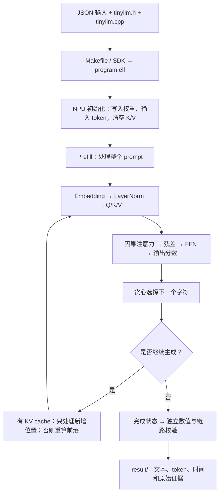

# LLM 简要说明

[返回文档目录](README.md)。

`user/llm` 是一个可读的字符级 TinyLLM：用短文本作为输入，每次预测一个字符。
默认输入 `"red "`（末尾有空格），生成 `"blu"`，对应 token ID 为 `[4, 10, 15]`。

## 1. 用户需要看的文件

| 文件 | 内容 |
|---|---|
| `user/llm/config.json` | prompt、生成长度、KV cache，以及 NPU、AXI、UCIe、MEMSIM 参数 |
| `user/llm/src/Makefile` | 声明 `tinyllm.cpp` 和模型头文件，调用 SDK 编译 |
| `user/llm/src/tinyllm.h` | 模型维度、词表、权重及模型布局信息 |
| `user/llm/src/tinyllm.cpp` | 初始化、注意力、FFN 和逐字符生成 |
| `user/llm/result/` | 每次运行的 ELF、配置、结果和验收记录 |

已有头文件包含权重，可以直接编译运行。SDK 自动生成本次输入的
`project_config.h`，并将独立校验所需的模型快照附在 ELF 中。

## 2. 如何运行和改输入

先从仓库根目录执行 `./build.sh`，然后：

```bash
cd user
./run.sh llm
```

编辑 `llm/config.json` 中的 `program`：

```json
{
  "type": "tiny_llm",
  "prompt": "red ",
  "generated_tokens": 3,
  "kv_cache": true
}
```

只替换 JSON 中的 `program` 对象，保留其余配置组。

| 字段 | 说明 |
|---|---|
| `prompt` | 非空字符串；字符必须在模型词表中 |
| `generated_tokens` | 生成 1～8 个字符 |
| `kv_cache` | true 复用之前的 K/V；false 每轮重新计算前缀 |

词表为换行、空格、句点，以及 `a b c d e h i l n o r t u w`，共 17 个字符。
要求 `prompt 字符数 + generated_tokens - 1 <= 16`；最后生成的字符不再送入下一轮计算。
NPU、AXI、UCIe、MEMSIM 参数的修改方法见 [环境配置说明](01-用户环境配置说明.md)。

## 3. 程序如何计算

模型为单层 Transformer：维度 8、注意力头 2、FFN 维度 16、上下文 16。
采用 LayerNorm、因果注意力、ReLU FFN 和贪心选择，共 1001 个有效模型参数。
头文件中的权重数组分配 1004 个 float，包含布局对齐的填充。



计算在 CoralNPU RTL 执行的 RV32 标量 FP32 程序中完成。
权重、KV、token 和观测记录走外部 AXI → UCIe → MEMSIM；局部临时数组由设备程序使用。

## 4. 输出看哪里

终端会打印当次结果目录，优先查看以下文件：

| 文件 | 内容 |
|---|---|
| `report.md` | 输入文本、生成文本、token ID、周期和阶段时间 |
| `llm_summary.json` | 独立数值误差、KV 检查、访存分布和逐 token 时间 |
| `summary.json` | 全部检查的最终结论，要求 `passed=true` |
| `input.json` / `resolved.json` | 用户本次保存的配置／实际运行配置和模型信息 |
| `npu_requests.csv` / `axi_wave.vcd` | 设备请求和真实 AXI 五通道活动 |
| `ucie_flits.csv` / `memsim_bridge.csv` | 链路传输与内存请求返回 |

独立参考根据 ELF 中的实际模型信息核对权重、K/V、中间结果和生成 token。
设备完成状态、数值校验、AXI／Flit／内存检查都通过，最终才会显示 PASS。
这是小型功能验证模型；报告时间包含观测记录的访存开销。

需要对照不同配置时，在 `user/` 中执行 `./run.sh llm --test`。
它运行默认、慢内存、链路重放、反压、关闭 KV cache、长输入六个场景。

## 跟着默认输入看字符怎样生成

词表给每个字符分配编号：`r=13`、`e=7`、`d=6`、空格 `=1`。
所以 `"red "` 先变成 `[13,7,6,1]`，程序计算的直接输入是这些编号。
词表只包含 `"\n .abcdehilnortuw"` 中的字符；大小写不同也会改变输入是否合法。

| 第几轮 | 已知文本 | 本轮产生 | 开 KV 时本轮计算位置数 | 关 KV 时本轮计算位置数 |
|---|---|---|---:|---:|
| 1 | `red ` | `b`，ID 4 | 4 | 4 |
| 2 | `red b` | `l`，ID 10 | 1 | 5 |
| 3 | `red bl` | `u`，ID 15 | 1 | 6 |
| 合计 | 生成部分是 `blu` | 3 个字符 | 6 | 15 |

前两轮生成的字符还要送进下一轮；第三轮已达到数量，最后的字符不再做一次前向计算。
这就是上下文约束中使用 `prompt长度 + 生成数 - 1` 的原因。

每轮实际耗时还包括访问权重、KV 和写入观测记录。
不能把 15÷6 直接当作实测加速比。比较性能时先保证两次结果与检查都通过。

## 程序里的计算步骤

| 代码中的名字 | 在程序里是什么意思 |
|---|---|
| Embedding | 把字符编号查表换成 8 个数，再加上位置对应的 8 个数 |
| LayerNorm | 计算这 8 个数的平均值和变化幅度，再调整数值尺度 |
| Q/K/V | 当前内容经过三套权重得到的数；Q 与已有 K 比较相关程度，用比较结果汇总 V |
| Softmax | 把若干分数变成非负、总和为 1 的权重 |
| FFN | 对每个位置做两次线性变换，中间把负数截成 0 |
| logits | 17 个候选字符各自的分数；程序选最高分的编号 |
| KV cache | 保存以前位置的 K/V，下次继续使用，减少重复计算 |
| trace | 程序主动写出的中间计算结果，供独立参考核对 |

## 改了输入后怎样检查结果

复制完整配置，修改 `program.prompt`，再运行 LLM。
空格和换行都可能属于输入；先核对 `input.json` 的字符串，
再核对 `llm_summary.json` 的输入 token 和生成 token。
词表外字符通常在编译准备模型输入时被拒绝；JSON 语法正确并不代表词表检查已通过。

切换 KV cache 的完整命令见 [改配置、运行程序和看结果](05-配置实验与USER负载详解.md)。
修改 prompt 后不要继续套用默认 `blu` 作为答案，校验器会根据本次输入独立计算。
