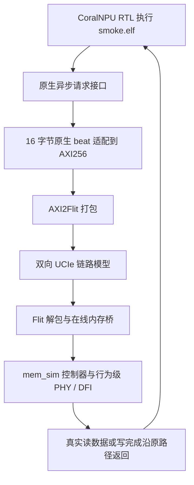

# SMOKE：从拿到项目到看懂完整链路

这篇报告用最简单的 **41 加一得到 42**，说明如何准备项目、配置负载、编译设备程序、运行仿真，以及怎样用实际证据确认每一段链路都工作了。

SMOKE 已实际运行通过：CoralNPU 执行 293 个周期，完成四笔外部事务、10 次 AXI 五通道握手，最后从外部内存读回 42。放慢在线内存后，仍得到 42，但设备增加到 821 个周期。以下数字来自 2026-09-25 的新结果目录，不是理论估计。

## 1. 拿到项目后，先确认拿到了哪些东西

本次交付是在当前项目目录中完成的：

```text
/home/hy258/hy/zhongxing/coralnpu_StorageStacked
```

拿到包含本次修改的完整源码目录后，先阅读 [README.md](../README.md) 和 [config/README.md](../config/README.md)。至少应能找到：

| 内容 | 位置 | 用处 |
|---|---|---|
| 统一入口 | [run.sh](../run.sh) | 准备、构建、SMOKE、普通负载、LLM 和完整验收 |
| SMOKE 原始程序 | [benchmarks/smoke/kernel.cc](../benchmarks/smoke/kernel.cc) | NPU 实际执行的加一程序 |
| SMOKE 参数 | [config/benchmarks/smoke.json](../config/benchmarks/smoke.json) | 选择负载和输入整数 |
| 共用架构参数 | [config/architecture.json](../config/architecture.json) | 时钟、AXI、UCIe 反压/重放和在线内存参数 |
| CoralNPU 源码 | `third_party/coralnpu/` | 生成本项目自己的 RTL 仿真模型 |
| 独立 SystemC 源码 | `../axi_StorageStacked/third_party/systemc/` | 统一仿真调度 |
| 存储与链路源码 | `../axi_StorageStacked/storage_axi/`、`../axi_StorageStacked/axi2flit/`、`../axi_StorageStacked/ucie-model/`、`../axi_StorageStacked/mem_sim/` | 后级总线、链路、存储控制器与行为模型 |

源码包含在本项目中，不需要从另一份 StorageStacked 工程加载代码或动态库。本次修改没有推送到远端；若通过 Git 获取，需确认所取版本确实包含 `benchmarks/smoke/kernel.cc` 和 `run.sh smoke`，不能用旧版本代替这份交付。

首次准备需要 Linux x86-64、Bash、Git、curl、make、patch、tar 和基础 C/C++ 构建工具，并需要下载固定版本依赖的网络或已经准备好的本地缓存。建议至少 32 GB 内存，主要供 RTL 构建使用。SMOKE 本身不需要模型、NumPy、PyTorch 或训练数据。

## 2. 一步一步完成部署和运行

在项目根目录执行：

```bash
# 1. 准备本项目的固定版本工具和依赖
./run.sh setup

# 2. 构建在线内存库、CoralNPU 原生库和独立 SystemC 运行器
./run.sh build

# 3. 检查工具、动态库和项目隔离
./run.sh check

# 4. 运行最小负载，并检查计算与整条链路
./run.sh smoke --output results/my-smoke
```

`results/my-smoke` 必须是尚不存在的目录。重复运行时换一个名字，或直接执行 `./run.sh smoke`，让程序自动创建时间戳目录。

`setup` 准备 `.deps/`；`build` 默认构建公共运行库和普通内存负载；第一次 `smoke` 会自动生成 SMOKE 头文件并编译 `smoke.elf`。已有本项目可用构建时，通常只需最后一条命令。

`check` 成功只表示环境可用。只有 `smoke` 跑完计算、字节、链路和波形检查后，`summary.json` 才会写入 `"passed": true`。

换目录或换机器后执行 `setup` 和 `build`，重建与当前路径匹配的产物。不要直接使用别的工程编译的 `.so` 或旧绝对路径缓存。`SS_OFFLINE=1` 只约束 setup 下载；没有提前准备 Bazel 依赖缓存时，首次构建仍可能需要网络。

## 3. 为什么重构 benchmarks，重构成什么样

此前 `benchmarks/` 中有平铺的 `memory_roundtrip.cc`、`tiny_llm.cc`，以及一个空的 `llm/`。目录名与实际源码位置不对应，也缺少一个说明各负载用途的入口。

现在统一为：

```text
benchmarks/
├── README.md                 # 三个负载的索引
├── smoke/
│   ├── README.md             # 最小负载的运行方法
│   └── kernel.cc             # 四笔外部事务
├── memory_roundtrip/
│   ├── README.md
│   └── kernel.cc             # 原有多字、多轮、跨步负载
└── tiny_llm/
    ├── README.md
    └── kernel.cc             # 原有微型 Transformer
```

原有内存和 LLM 的计算源码仅移动位置，运行入口仍是 `./run.sh run` 和 `./run.sh llm`。配置继续统一保存在 `config/`，构建、运行和校验工具继续在 `scripts/`。没有为 SMOKE 再建立一套独立仿真平台。

不要编辑 `third_party/coralnpu/native/` 中自动复制的源码或生成头文件；下一次构建会覆盖它们。负载的原始源码入口现在统一是 `benchmarks/负载名/kernel.cc`。

## 4. SMOKE 代码到底做了什么

核心逻辑是：

```cpp
*input = SMOKE_INPUT;           // 第 1 笔：向外部内存写 41
const uint32_t value = *input;  // 第 2 笔：从外部内存读 41
*output = value + 1u;           // 第 3 笔：在 NPU 内加一，向外部内存写 42
const uint32_t observed = *output; // 第 4 笔：从外部内存读 42
```

三个地址如下：

| 地址 | 内容 | 是否走外部存储链路 |
|---|---|---|
| `0x90000000` | 输入整数，默认 41 | 是 |
| `0x90010000` | 输出整数，默认 42 | 是 |
| `0xc0000000` | 完成 mailbox | 否，属于设备控制状态 |

`input`、`output` 都是 `volatile uint32_t*`，要求程序实际发出读写；加一使用读回的值。程序、栈和启动过程在本地 TCM 中，外部输入由 NPU 自己写入，没有宿主预填外部 RAM。

NPU 比较 `observed` 与独立计算的 `SMOKE_INPUT + 1`。相等写 mailbox `0x600d0000`，否则写 `0xbad00001`，随后执行 `wfi`。mailbox 只是第一层完成检查，Python 后续还必须从链路中实际观察到 41 和 42，并确认所有事务闭合。

这个程序没有循环、矩阵、模型或额外观察区写入，便于逐笔追踪。输入和输出分开存放，也让最终内存镜像可以同时保留二者。

## 5. 配置如何写，如何生效

[config/benchmarks/smoke.json](../config/benchmarks/smoke.json) 只有两个字段：

```json
{
  "name": "smoke",
  "input": 41
}
```

`name` 必须为 `smoke`，`input` 必须是 0～4294967295 的整数。结果按 uint32 运算，即 `(input + 1) mod 2^32`。多余字段、负数、越界值或布尔值会被拒绝。

更改输入时，可以复制这个 JSON 到 `config/benchmarks/my_smoke.json`，编辑后运行：

```bash
./run.sh smoke --benchmark config/benchmarks/my_smoke.json
```

源码修改后先 `./run.sh build`，再运行 SMOKE；仅修改输入配置时，运行器会自动重编译设备 ELF。

默认架构来自共用的 `config/architecture.json`：

| 参数 | 本次默认值 | 含义 |
|---|---:|---|
| `device_clock_mhz` | 500 | NPU 每个周期 2 ns |
| `axi.period_ns` | 2 | AXI 时钟周期 2 ns |
| `axi.outstanding` | 16 | 适配器允许的在途上限，实际 SMOKE 最大为 1 |
| `axi.planes` | 2 | 链路桥资源平面数 |
| `axi.stalls` | true | 确定性的五通道等待，用于观察握手稳定性 |
| `axi.replay` | false | 本次最小 SMOKE 不注入 CRC 错误 |
| `memory.standard` | hbm4 | 在线内存采用 HBM4 行为模型预设 |
| `memory.channels` | 2 | 两个内存通道 |
| `memory.scale` | 1 | 默认内存时间倍率 |
| `memory.queue` / `memory.slots` | 4 / 8 | 内存队列深度、桥请求槽数 |
| `memory.response_hold` | 0 | 不额外扣留已完成响应 |
| `max_ticks` | 20000000000000 fs | 20 ms 仿真时间上限，超时失败 |

`./run.sh smoke --scale 4` 只覆盖当次内存时间倍率，不改 JSON。实际采用的完整参数写在 `resolved.json`，主程序读入值写在 `config.json`，内存实际配置写在 `memsim_config.json`。这些文件可以确认参数真的传到了对应模块。

## 6. 从配置到 ELF，中间哪些文件起作用

| 阶段 | 代码位置 | 做的事 |
|---|---|---|
| 命令入口 | [run.sh](../run.sh) | 把 `smoke` 转成 `run --benchmark config/benchmarks/smoke.json` |
| 参数检查 | [scripts/configure.py](../scripts/configure.py) | 验证配置；复制 `kernel.cc` 为 `native/smoke.cc`；生成 `smoke_config.h` |
| 设备编译 | [scripts/build_device.sh](../scripts/build_device.sh) | 构建 `//native:smoke.elf`，保存到 `build/coralnpu/smoke.elf` |
| 编译目标 | [integration/coralnpu/BUILD.bazel](../integration/coralnpu/BUILD.bazel) | 声明 SMOKE C++ 程序和配置头文件 |
| 启动与记录 | [scripts/run.py](../scripts/run.py) | 管理构建锁、新结果目录、配置与运行文件快照，启动仿真和验收 |
| ELF 装载 | [integration/coralnpu/coralnpu_native.cc](../integration/coralnpu/coralnpu_native.cc) | 将 ELF 装入本地 TCM，设置入口并启动 RTL |
| 公共校验 | [scripts/validate.py](../scripts/validate.py)、[scripts/verify.py](../scripts/verify.py) | 检查协议、字节、源回调、五通道波形和完成状态 |
| SMOKE 校验 | [scripts/verify_smoke.py](../scripts/verify_smoke.py) | 要求四笔真实事务满足固定顺序及独立公式，生成逐笔链路时间表 |
| 负例检查 | [scripts/check_smoke_negative.py](../scripts/check_smoke_negative.py) | 损坏结果、删事务、加事务或换顺序后，要求验收拒绝 |

默认生成的 `smoke_config.h` 中只有输入常量 `#define SMOKE_INPUT 41u`。这个常量决定 NPU 首次写什么；验收期望从当次 JSON 独立计算，不依赖设备声称的正确结果。

本次 `smoke.elf` 为 50,516 字节，这是包含 ELF 元数据的文件大小，不是外部访问字节数或指令存储占用。程序实际运行文件及大小记录在 `environment.json`。

## 7. 四笔事务经过什么链路



各段职责如下：

1. **NPU 执行程序。** `[0x90000000] = 41` 是 RTL 中执行的存储指令。原生驱动捕获外部访问，分配序号，等待真实完成回调。
2. **有界异步适配。** [simulation/axi_master.cc](../simulation/axi_master.cc) 将请求放入有界队列，驱动实际 AXI 信号，并把接收的 B/R 响应返回 NPU。队列满时可以反压，不会直接伪造成功。
3. **AXI 五通道握手。** 写操作经过 AW 地址、W 数据和 B 完成；读操作经过 AR 地址和 R 数据。VALID 在 READY 到来前必须保持，数据也要保持稳定。
4. **打包成 Flit。** [公共 AXI 存储入口](https://github.com/hy2581/axi_StorageStacked/blob/main/storage_axi/aou_backend.cc) 连接 AXI2Flit、封装/解包器和 UCIe 模型。AXI 请求被编码，真正经过链路交付后，内存端才接收。
5. **在线内存执行。** [公共内存桥](https://github.com/hy2581/axi_StorageStacked/blob/main/storage_axi/memsim_backend.cc) 连接 [在线 mem_sim](https://github.com/hy2581/axi_StorageStacked/blob/main/mem_sim/integration/online.cpp)。存储控制器安排 ACT、RD、WR 等命令，行为级 PHY/DFI 处理实际字节与完成时间。
6. **返回影响设备。** 完成信息沿链路返回，适配器通过 `coralnpu_complete` 调用 RTL 的 `CompleteWrite` 或 `CompleteRead`。读指令获得数据后，NPU 才能继续依赖它的计算。慢内存因此会增加设备周期。

整条链路由本项目独立构建的一套 Accellera SystemC 调度，全局分辨率是 **1 fs**。原生接口是事务回调适配，后级 AXI 有真实五通道信号和 VCD；不能把这理解成 RTL 原始管脚不经适配就逐线接到 UCIe。

### 四笔事务为什么有 10 次握手

| 步骤 | 实际操作 | 外部值 | AXI 握手 |
|---|---|---:|---|
| 1 | 写输入 `0x90000000` | 41 | AW、W、B |
| 2 | 读输入 `0x90000000` | 41 | AR、R |
| 3 | 写输出 `0x90010000` | 42 | AW、W、B |
| 4 | 读输出 `0x90010000` | 42 | AR、R |

所以是 `2 × 3 + 2 × 2 = 10` 次握手，每个通道各 2 次。mailbox 和本地取指不计入这四笔外部内存事务。

每次计算访问的有效整数为 4 字节，但 CoreMiniAxi 的原生 beat 为 16 字节，后级 AXI 总线为 32 字节宽。两笔写的有效掩码为 `0x000f`，只更新最低四个字节；读返回包含整个原生 beat。统计中的 64 字节是 `4 × 16` 的原生接口传输量，有效整数访问量是 `4 × 4 = 16` 字节，二者不能混用。

## 8. 本次运行实际得到了什么

本次已执行现有环境的 `setup` 检查、重构后的 `build`、SMOKE 单例，以及包含 SMOKE 的新完整验收。`setup` 确认已有工具与锁定版本一致；这不表示又在一台空白机器上重装过依赖。

单例原始证据在 `results/smoke-first-20260925/`；完整验收目录为 `results/acceptance-smoke-20260925/`，其中 `smoke/` 和 `smoke_slow/` 是本报告对照用例。两个目录的默认 SMOKE 结果一致。

最终又执行 `./run.sh smoke --output results/smoke-final-20260925`，独立复验通过。新入口直接打印：

```text
SMOKE: 41 + 1 = 42 (uint32); 4 external transactions; 10 AXI handshakes; 293 NPU cycles
```

随后打印本次 `smoke_report.md` 和 `summary.json` 的绝对路径。

| 指标 | 默认 SMOKE | 慢内存 SMOKE |
|---|---:|---:|
| `memory.scale` | 1 | 4 |
| NPU 输入 / 实际回读输出 | 41 / 42 | 41 / 42 |
| NPU 周期 | 293 | 821 |
| 外部读 / 写事务 | 2 / 2 | 2 / 2 |
| AXI 五通道握手总数 | 10 | 10 |
| 平均外部往返时间 | 74 ns | 338 ns |
| 计算与全链路验收 | PASS | PASS |

默认场景还有以下原始证据：

- NPU 完成时刻为 **608 ns**，mailbox 为 `0x600d0000`。
- 在途峰值为 1，接收与完成事务均为 4，结束时排空。
- 五通道 VCD 中 W 等待了 8 个采样边沿、B 等待了 2 个，检查确认等待期间 VALID 与载荷保持稳定。
- 在线内存实际完成两次 WR、两次 RD，记录两次 ACT；对应 4 个 DFI 数据事件。
- 桥侧 Flit 统计为发送 15、接收 20；双向链路交付总计 35，结束时无在途 Flit，解码核对出 10 条业务消息。Flit 还包含控制信息，因此不能把 35 直接当成访问次数。
- 最终内存输入低四字节为 `29 00 00 00`，输出为 `2a 00 00 00`，分别对应小端整数 41 和 42。镜像中地址是窗口内偏移：输入 `0x0`，输出 `0x10000`。

### 四笔事务的真实时间表

下表单位均为 ns，是同一全局仿真时间轴上的绝对时刻：

| 步骤 | NPU 发起 | AXI 地址握手 | 正向 Flit 到达 | 内存接收 | RD/WR 命令 | 内存返回 | 反向 Flit 到达 | AXI 响应 | NPU 完成 |
|---|---:|---:|---:|---:|---:|---:|---:|---:|---:|
| 写 41 | 248 | 256 | 271.333424 | 272.25 | 370.25 | 375.75 | 382.000048 | 394 | 396 |
| 读 41 | 400 | 402 | 412.000048 | 414.25 | 414.25 | 430.75 | 438.000048 | 446 | 448 |
| 写 42 | 464 | 470 | 485.333424 | 486.25 | 494.25 | 499.75 | 508.000176 | 516 | 518 |
| 读 42 | 522 | 524 | 534.000048 | 536.25 | 536.25 | 552.75 | 560.000048 | 568 | 568 |

“正向 Flit 到达”取该操作所有请求消息的最后到达时刻，写操作包含地址和数据。“反向 Flit 到达”对应响应消息到达。时间表来自源回调、AXI、原始 Flit 解码和在线内存证据的关联结果，不是把平均延迟拆分后填进去。

例如第一笔写：NPU 在 248 ns 发起，内存到 272.25 ns 才接收，370.25 ns 发出 WR，375.75 ns 完成内存侧操作，396 ns 才反馈给 NPU，往返共 148 ns。之后第二笔才开始。最后一笔中 AXI 握手与原生回调同为 568 ns，属于同一仿真时刻的调度，不代表数据提前返回。

### 如何解释结果

四次往返分别为 **148、48、54、46 ns**，总和 296 ns，平均 74 ns。它们没有包含本地启动、加一、比较和 mailbox 等全部程序开销，因此不能用往返总和替代总运行时间。

第一笔明显较慢。日志显示它在内存接收后等待控制器调度，并经历 ACT 后才发出 WR；不能把这段等待全部算成 UCIe 传输或直接拿来代表稳态带宽。最小负载也不足以测量饱和吞吐。

500 MHz 下，293 个设备周期对应 586 ns；全局完成时刻为 608 ns，因为全局时间还包含开始设备步进前的复位/链路准备。主循环按时间段推进仿真，波形最后时刻可能晚于设备结束，判断完成应使用 `completion.json` 的 `tick_fs`。

把内存时间倍率改为 4 后，四笔事务的数据与数量保持不变，平均往返变为 338 ns，NPU 增加 528 个周期。这证明等待由在线内存真正反馈到设备执行。倍率作用于内存时间轴，包含调度、刷新和相位的变化，整机时间或某笔访问延迟不要求恰好乘四。

慢内存场景的四次往返分别为 **98、104、1050、100 ns**，最明显的等待落在第三笔写入：493 ns 接收，1449 ns 才发出 ACT，1481 ns 发出 WR，1503 ns 返回。第一笔反而比默认场景更快。这说明极短负载对控制器调度与刷新所处的时刻很敏感，不能仅凭四笔事务把平均值外推成一般内存性能。

## 9. 如何确认通过，以及如何查看证据

首先查看结果目录的 `summary.json`，再按需要打开以下文件：

| 文件 | 主要用途 |
|---|---|
| `summary.json` | 计算、源接口、协议、内存与波形的最终综合结论 |
| `smoke_report.md` | 四笔事务的简明文字报告 |
| `smoke_summary.json` | 实际输入/输出、逐笔链路时间、往返时间 |
| `resolved.json` / `environment.json` | 实际配置、来源版本、运行文件名与大小 |
| `npu_requests.csv` | RTL 原生请求及真实完成回调；默认共 8 行事件 |
| `axi_events.csv` / `axi_wave.vcd` | 实际 AW/W/B/AR/R 握手与信号波形 |
| `ucie_soc.csv` / `ucie_mem.csv` / `ucie_flits.csv` | 两端和合并后的链路发送/接收记录 |
| `axi_flit_path.csv` | 从原始 Flit 解码后关联到 AXI 的请求/响应路径 |
| `memsim_bridge.csv` | 内存桥接收、提交、完成、返回事件 |
| `memsim_commands.csv` / `memsim_dfi_signals.csv` | 实际内存命令与行为级 DFI 数据 |
| `memsim_image.csv` | 最终存储字节，地址为外部窗口内偏移 |
| `wave_audit/summary.json` | 从原始 VCD 独立检查握手、稳定性和排空 |
| `memsim_view.html` / `trace_view.html` | 按事务浏览链路与数据 |

浏览 HTML 时，在项目根目录启动：

```bash
python3 -m http.server 8000
```

然后在浏览器访问本机端口 8000 下对应结果目录的 `memsim_view.html`；SSH 远程环境可转发该端口。复制报告页面时，要把同目录下的分块数据和脚本一起复制。SMOKE 原始证据很小，建议直接交接整个用例目录。

检查器除了匹配结果，还要求：四笔操作严格为 W/R/W/R、地址正确、写掩码正确、读取字节正确、无缺失或额外事务、时序满足因果关系。公共检查把这些请求继续关联到 AXI、Flit、内存、DFI 和最终镜像，并要求排空。

[check_smoke_negative.py](../scripts/check_smoke_negative.py) 从真实运行证据复制后注入六种错误：输入错误、输出错误、回读错误、少一笔、多一笔、事务换序，均应被拒绝。另有三种非法配置拒绝和 uint32 两端合法配置检查；合法配置边界检查本身不代表边界值另跑过 RTL。

完整回归执行：

```bash
./run.sh test --output results/my-smoke-regression
```

该命令包含两个 SMOKE、五个原有内存场景、六个 LLM 场景，以及 19 项 mem_sim 原生测试、在线 C ABI 和各类负例检查。最终实测汇总见 [ACCEPTANCE.md](../ACCEPTANCE.md)，便于携带的证据见 [SMOKE 验收目录](../validation/2026-09-25-smoke/README.md)。

本次 13 个场景已全部新跑并通过，没有复用旧结果；原有内存和 LLM 的周期、生成结果与重构前一致。19 项原生测试、在线接口及全部负例/配置检查同样通过。这同时验证了目录调整后的构建与运行入口仍然有效。

## 10. 出问题时从哪里找，以及本次验收的范围

| 现象 | 优先检查 |
|---|---|
| 参数非法、未知字段 | `config/benchmarks/smoke.json` 与命令行参数 |
| 已存在输出目录 | 换一个新的 `--output`，保留原证据 |
| 首次运行找不到库或工具 | 完成 `setup`、`build`，再运行 `check` |
| 自动编译失败 | 结果目录 `benchmark-build.log` |
| NPU 超时或 mailbox 错误 | `run.log`、`completion.json`、源请求/响应是否配对 |
| 设备结束但综合验收失败 | `verification.log`、`validation-run.log`、`summary.json` 的阶段信息 |
| 移动源码后旧路径失效 | 使用 `benchmarks/负载名/kernel.cc`，执行 `build` 重建 |

这次 SMOKE 证明：当前固定架构下，NPU 确实执行计算，四笔外部访问穿过完整在线链路，数据、响应、命令和波形可以逐笔对应，慢内存会影响设备周期。

它没有覆盖大模型计算、多在途饱和性能、长 burst 或全部内存标准，也不代替 LLM 回归。当前内存 PHY/DFI 为行为模型，HBM4 预设含临时时序项；这些结果用于本项目的功能与时序比较，不是物理层或量产芯片签核。
