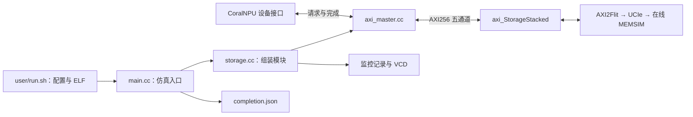
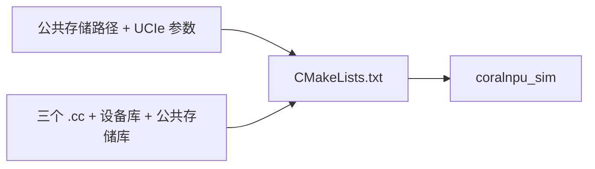
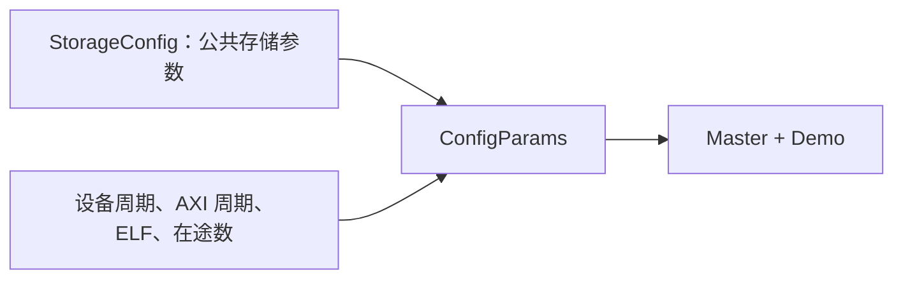
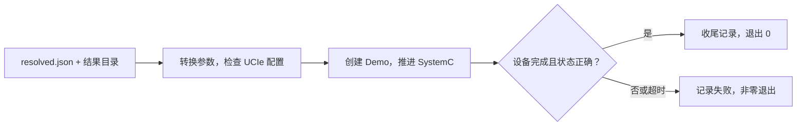
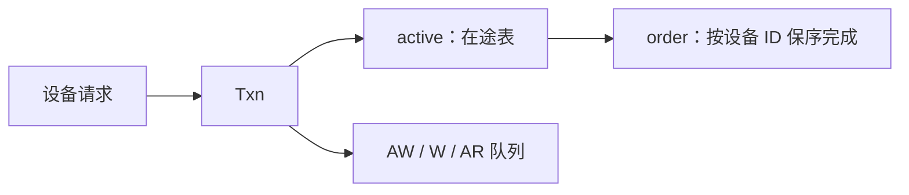
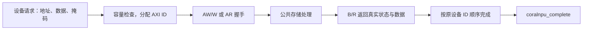
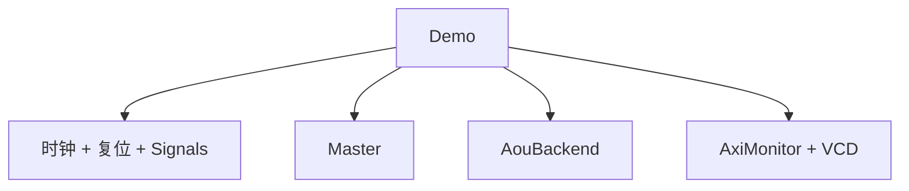
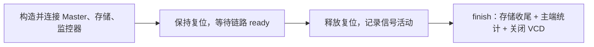

# integration 介绍

[文档目录](README.md) · 按需查参数，第一次使用先看目录中的入门或配置实验。

`integration/` 把 CoralNPU 设备接口接到公共 AXI 存储项目，并提供仿真进程入口。
用户通过 `user/run.sh` 启动它，通常只需修改项目 JSON。

```text
integration/
├── CMakeLists.txt
├── config.hh
├── main.cc
├── axi_master.hh
├── axi_master.cc
├── storage.hh
└── storage.cc
```



## 1. CMakeLists.txt：构建运行器

接收公共存储的相对路径 `STORAGE_PATH` 和四个 `LINK_*` 参数。
通过 `add_subdirectory` 使用公共存储源码，关闭公共项目的独立 CLI。
把 `main.cc`、`axi_master.cc`、`storage.cc` 编译为 `coralnpu_sim`，
链接 `StorageStacked::axi` 和 `libcoralnpu-native.so`。
构建产物放在 `coralnpu/.cache/build/`，由根目录构建入口和用户运行入口管理。



## 2. config.hh：接入参数

定义 `ConfigParams`，继承公共项目的 `StorageConfig`。
公共部分保存存储窗口、内存和链路参数；新增设备周期、AXI 周期、
watchdog 上限、在途请求数、反压开关和 ELF 路径。
内部时间字段使用 fs，默认设备与 AXI 周期均为 2000000 fs。
用户改 JSON，`main.cc` 负责转换和填充这些字段。



## 3. main.cc：读取配置并推进仿真

`sc_main` 接收两个参数：`resolved.json` 和结果目录。
它设置全局 1 fs 时间分辨率，把 JSON 转成 `ConfigParams`，
并检查运行参数与已编译的 UCIe 参数是否一致。
创建 `Demo` 后推进 SystemC，直到设备完成或超时。

输出 `config.json`、`ucie_config.json` 和 `completion.json`。
设备完成且 mailbox 为 `0x600d0000` 才算执行成功；之后还需运行独立校验器，
才能得到用户看到的最终 `summary.json.passed=true`。



## 4. axi_master.hh：设备主端的数据结构

声明 `Master` 模块及其 AXI 主端端口。
`Txn` 保存一笔请求的地址、16 字节数据、掩码、设备 ID、AXI ID 和时间。
`active` 保存未完成请求，`awq/wq/arq` 管理通道队列，
`order` 保证同一读写方向、同一设备 ID 的完成顺序。
统计字段提供接收数、完成数、最大在途数和容量拒绝次数。



## 5. axi_master.cc：请求与响应转换

创建设备、加载 ELF，分别按设备时钟和 AXI 时钟推进。
收到 16 字节对齐的设备请求后，分配空闲 AXI ID（1～1023），
发出单拍 INCR 访问：`AxLEN=0`、`AxSIZE=4`。

16 字节设备数据按地址放到 32 字节 AXI 总线的对应字节位置，写掩码同步移动。
收到 B/R 握手后，取出真实返回数据和响应状态，按设备 ID 顺序调用
`coralnpu_complete`。达到 `outstanding` 上限时停止接收新请求。

`stalls=true` 会错开发送 AW/W，并周期性拉低 BREADY/RREADY，用于验证反压。
这里生成 `npu_requests.csv` 和 `transactions.csv`，记录请求、返回及其时间。



## 6. storage.hh：仿真模块声明

声明顶层 SystemC 模块 `Demo`。
它持有一组 AXI 信号 `Signals`、AXI 时钟、复位信号、设备主端 `Master`、
公共存储 `AouBackend`、协议监控器 `AxiMonitor` 和 VCD 句柄。
对 `main.cc` 提供完成状态、设备周期数、mailbox 和 `finish()`。



## 7. storage.cc：连线、复位与收尾

将主端和公共存储绑定到同一组 AXI 信号，并连接时钟和复位。
开始时保持复位 3.5 个 AXI 周期，再等待存储链路 ready 后释放。
同时注册外部 AXI、内部链路和时钟复位波形。

`finish()` 收尾公共存储日志，将主端统计交给监控器，并关闭 VCD；重复调用不会重复收尾。
主要输出包括 `axi_wave.vcd`、`axi_events.csv`、`protocol_summary.json`，
以及公共存储生成的 Flit、MEMSIM、DRAM／DFI 记录。



修改连接行为后，从仓库根目录执行 `./build.sh --test`。
只修改用户 JSON 时，直接运行对应项目即可；UCIe 编译参数变化由入口自动处理。

## 跟着一笔读请求读源码

可以把“桥接”理解成翻译：上游说“读这个地址的若干字节”，桥把它转换成 AXI 信号，
等存储返回后再把字节交回上游。一次调用发起请求，不代表数据已经返回。

CoralNPU 原生接口一次交给桥一个 16 字节对齐的块。例如地址 `0x90000010`，
它位于 32 字节 AXI 总线的后半部，lane=16。桥发 `ARLEN=0`、`ARSIZE=4`，
等一拍 16 字节返回；从总线字节位置 16～31 取出数据，再按设备 ID 的顺序交回。
AXI 返回已经到达后，可能仍需等待更早的同 ID 请求和下一次设备时钟。

| 到哪个阶段 | 应观察什么 |
|---|---|
| 上游发出请求 | 地址、读写方向、长度、来源 ID |
| 桥正式接收 | 是否还有在途容量、分配了哪个 AXI ID |
| 地址握手 | `ARVALID && ARREADY` 的时钟上升沿 |
| 数据握手 | `RVALID && RREADY`；核对 ID、字节、响应码、末拍 |
| 上游收到完成 | 返回时间与数据；此后才释放相应事务资源 |

“反压”就是接收方暂时忙，要求发送方等一等。
波形上 `VALID=1, READY=0` 表示正在等；`VALID=1, READY=1` 才传走一拍。
AW/W 可以分别等待，写地址握手不表示写操作完成，还要等 B 响应。

## 遇到问题，定位到具体文件

| 问题 | 首先阅读 |
|---|---|
| JSON 参数看似没生效 | `resolved.json` 和本目录的参数填充代码 |
| 请求进了桥，却没有 AXI 地址 | `axi_master.cc` 的容量判断、复位与发送队列 |
| 返回字节位置不对 | `axi_master.cc` 的 lane 和掩码转换 |
| 仿真末尾还有在途请求 | 完成处理、队列释放和 `finish` 的调用顺序 |
| VCD 找不到关键信号 | `storage.cc` 的 trace 注册和波形关闭 |

修改本目录后回根目录重新构建。数值结果和存储链路都应重新核对，
不能用一次编译成功证明时序和返回数据正确。
